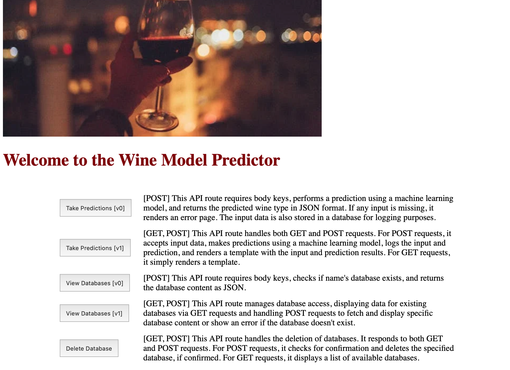

|Developed Using Python|Built Using Flask|
|--|--|
|||

|App is deployed in [Fl0](https://www.fl0.com)|Database is deployed on [AWS RDS](https://aws.amazon.com/rds/)|
|--|--|
|||

# Python Flask App Exercise
This is a [Flask](https://flask.palletsprojects.com/en/1.1.x/) app that take predictions with a modified [wine model from Sklearn](https://scikit-learn.org/stable/modules/generated/sklearn.datasets.load_wine.html).

This application is an exercise to test the knowledge acquired in class.

## Home Page

    
    The homepage has an index with a short explanation of what each API does. The result is returned as JSON in version 0. Version 1 collects information via a form. The result is displayed in HTML.

## Take Predictions

    
    Once the variables have been entered, they are passed to the trained model to make a prediction. Displays the result of the prediction and the inputs entered.

## View Database

    
    It is necessary to specify the database to be viewed. This is returned as JSON or HTML depending on the version. The database containing the samples and their predictions can be deleted from the same page (v1).

## Delete Database

    
    You must enter the database you wish to delete. The application will ask for confirmation before deleting (version 1 only).

<h1> 🤚⚠️ APPLICATION STATUS UPDATE</h1>

Database and application are currently disconnected from their servers.
